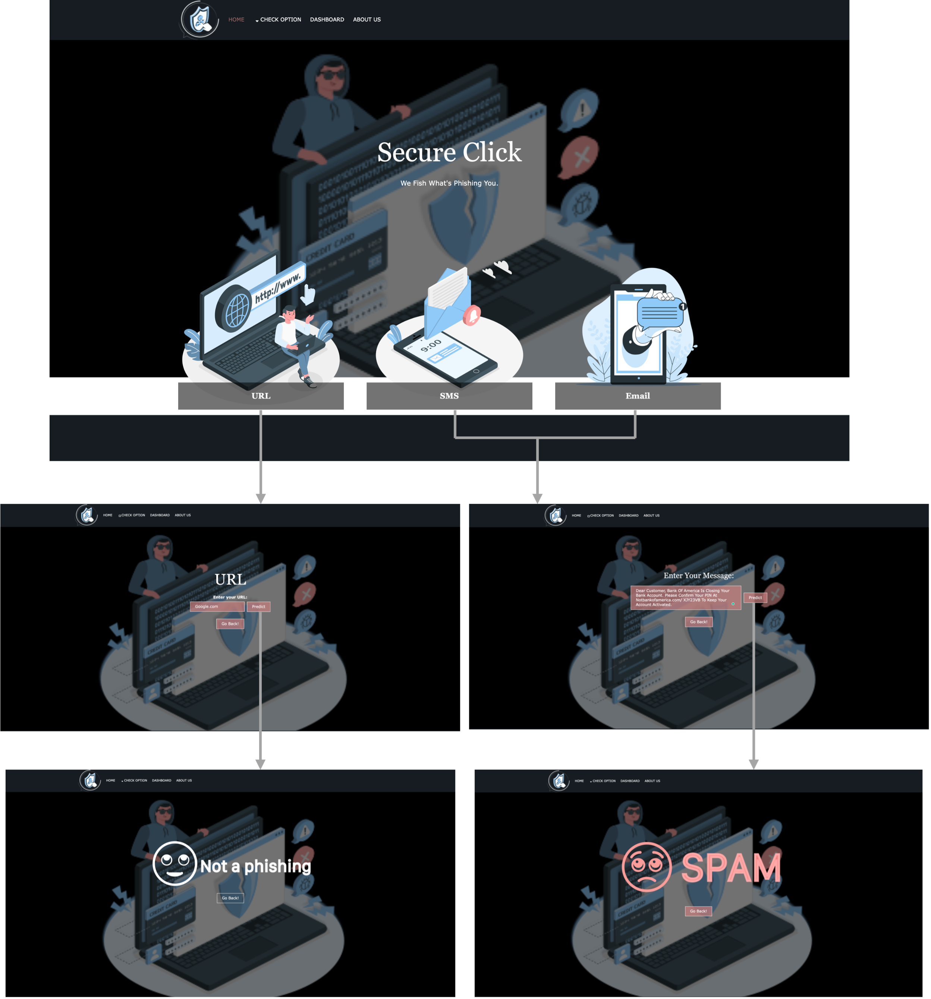
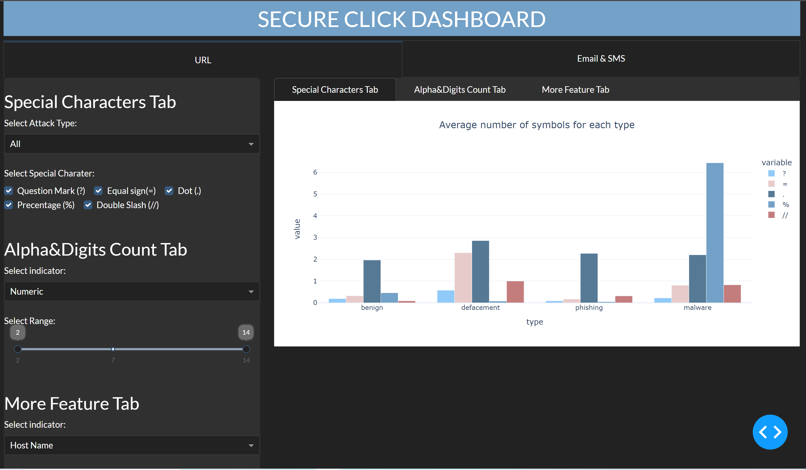

# Capstone Project 🎓 

#  Secure Click

### Team members (We worked together )
   - Razan Alyahya
   - Rahaf Aladhyani
   - Munirah Alsahly
   - Waleed Almutairi
         

### Objective:

  &nbsp;&nbsp;&nbsp; &nbsp; **[Phishing](https://www.imperva.com/learn/application-security/phishing-attack-scam/)** is a type of social engineering attack often used to steal user data, including login credentials and credit card numbers. It occurs when an attacker, masquerading as a trusted entity, dupes a victim into opening an email, instant message, or text message. The recipient is then tricked into clicking a malicious link, which can lead to the installation of malware, the freezing of the system as part of a ransomware attack or the revealing of sensitive information. An attack can have devastating results. For individuals, this includes unauthorized purchases, the stealing of funds, or identify theft.

Did you know that [91% ](https://www.googleadservices.com/pagead/aclk?sa=L&ai=DChcSEwiBnP_Z8rf9AhVH7O0KHYdwDHcYABAAGgJkZw&ohost=www.google.com&cid=CAESbeD2sOgzZ1ee7rJd_wc_-Za_QH9TNJ9GzFiI4m5IgAWuICh4oDp6oNclW0o2CUEi9VX0hDZXXMr0ncrZwKv-HJ1Dw98DQ8YUY80GRFXNFjaAx_azeWOvkHOJf9UIJ4rl18R__C65AUG8AojYFWY&sig=AOD64_0uc7BBmfArAG1gF7i_K7DHHcZJsQ&q&adurl&ved=2ahUKEwjf9vHZ8rf9AhXJa8AKHeBfD0cQ0Qx6BAgDEAE&nis=8) of successful data breaches started with a spear phishing attack.?

As technology continues to grow, phishing techniques started to progress rapidly and this needs to be prevented by using anti-phishing mechanisms to detect phishing. Machine learning and deep Learning are powerful tools used to strive against phishing attacks. So in this project, we will predict phishing (Sites and Messages) and fish what's phishing you.

### Dataset Overview:
#### &nbsp;&nbsp;&nbsp; - **For URL**

The dataset is available through the [Kaggle.](https://www.kaggle.com/datasets/sid321axn/malicious-urls-dataset)
This dataset contains only the URLs and Type.

**The Type is classified into:**
| Type               | Describes                                                                                                                                                              |
| -------------------- | ------------------------------------------------------------------------------------------------------------------------------------------------------------------------ |
[Defacement](https://www.imperva.com/learn/application-security/website-defacement-attack/)|Web defacement is an attack in which malicious parties penetrate a website and replace content on the site with their own messages. The messages can convey a political or religious message, profanity or other inappropriate content that would embarrass website owners, or a notice that the website has been hacked by a specific hacker group.
[Phishing](https://www.barracuda.com/support/glossary/url-phishing)|Cybercriminals use phishing URLs to try to obtain sensitive information for malicious use, such as usernames, passwords, or banking details. They send phishing emails to direct their victims to enter sensitive information on a fake website that looks like a legitimate website.
[Malware](https://gatefy.com/blog/what-malicious-url/)|Malicious URL is a link created with the purpose of promoting scams, attacks, and frauds. By clicking on an infected URL, you can download ransomware, virus, trojan, or any other type of malware that will compromise your machine or even your network, in the case of a compan
Benign|Safe or harmless websites.

For the URL part, features extraction has been done including URL length, URL digit count, URL letter count, URL Special character count ... etc.

#### &nbsp;&nbsp;&nbsp; - **For SMS and Email**
The dataset is available through the [Kaggle.](https://www.kaggle.com/datasets/uciml/sms-spam-collection-dataset)
This dataset contains only the Text and Type including(Ham and Spam).

### Proposed Algorithms:
#### &nbsp;&nbsp;&nbsp; - **For URL**
We used Machine Learning technique.
| Model               | Accuracy                                                                                                                                                              |
| -------------------- | ------------------------------------------------------------------------------------------------------------------------------------------------------------------------ |
Logistic regression |	
Gradient Boosting	|
Decision Tree	|
Random Forest|	

**Reseans for choosing the models:**
- After multiple research, we found two reaserch papers that used Decesion Tree, Random Forest and Logistic Regression and show high accuracy results. [[1]](https://arxiv.org/pdf/2205.05121.pdf)[[2]](https://www.researchgate.net/profile/Rishikesh-Mahajan/publication/328541785_Phishing_Website_Detection_using_Machine_Learning_Algorithms/links/5d0397fd92851c9004394af4/Phishing-Website-Detection-using-Machine-Learning-Algorithms.pdf)
- For the Gradient Boosting model we also found a research paper[[1]](https://www.ijraset.com/research-paper/url-based-phishing-website-detection)[[2]](https://ieeexplore.ieee.org/abstract/document/9400317) that used this model and it shows a high acuracy result. 

#### &nbsp;&nbsp;&nbsp; - **For SMS and Email**
We used Deep Learning technique.
| Model               | Accuracy                                                                                                                                                              |
| -------------------- | ---------------------------------------- |
Sequential Model |	98%

**Resean for choosing the model:**

### Final Results and Conclusion:
- For WebSite

- For Dashboard

