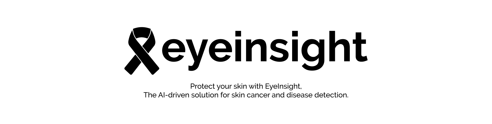
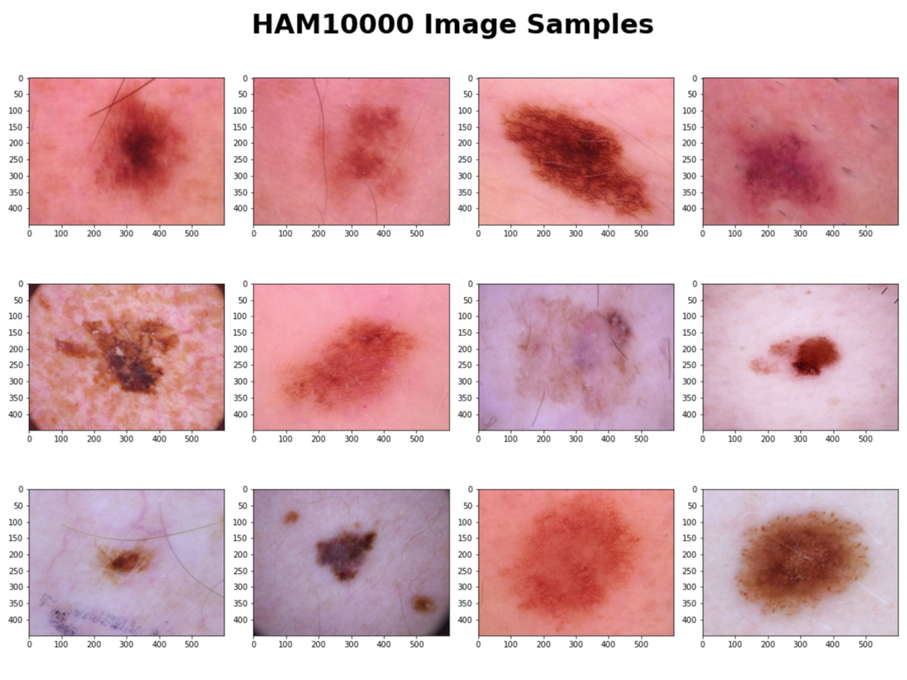
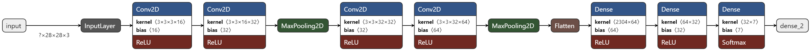
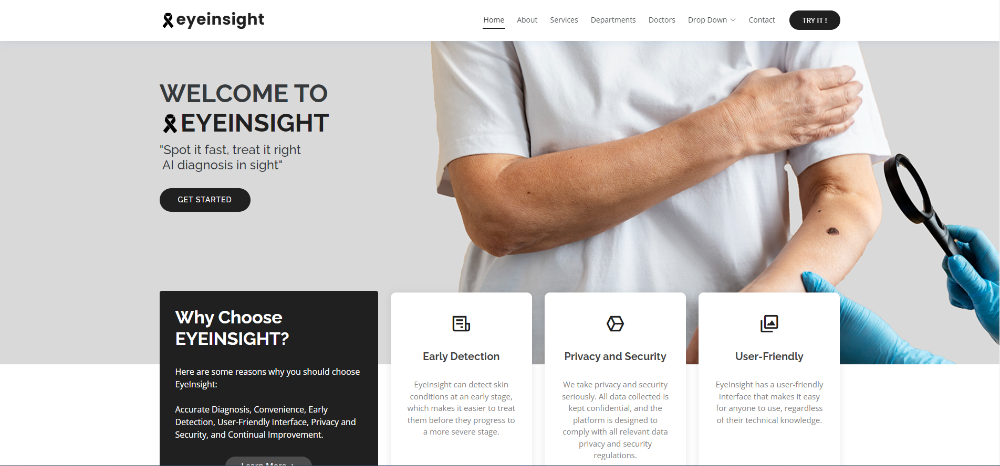

# EyeInsight  

### What is EyeInsight?

**EYEINSIGHT** is an AI-powered skin diagnosis tool designed to help individuals take control of their skin's health. By using advanced computer vision technology, EyeInsight can accurately detect and diagnose various skin cancers and diseases, including melanoma, basal cell carcinoma, and squamous cell carcinoma.

Using EyeInsight is easy - simply take a picture of the affected area and let the app do the rest. The AI algorithm will analyze the image and provide an instant diagnosis, giving you peace of mind and allowing you to take action quickly if necessary.

With EyeInsight, you can detect skin concerns early on and get the treatment you need to maintain healthy skin. Whether you're at home or on the go, EyeInsight empowers you to prioritize your skin's safety and take charge of your overall wellness.

## Team Members 

|Name|Role|
|---|---|
|Ali Almuhaysin|ML and Web Development & Reporting|
|Khalid AlSumali|Data analysis and Visualization & Content Anaysis|
|Mohamed Alshaikh|ML Development & Reporting|

## Dataset Overview

available and accessed [HERE](https://www.kaggle.com/datasets/kmader/skin-cancer-mnist-ham10000)

### Original Data Source
- Original Challenge: <https://challenge2018.isic-archive.com>
- <https://dataverse.harvard.edu/dataset.xhtml?persistentId=doi:10.7910/DVN/DBW86T>

[1] Noel Codella, Veronica Rotemberg, Philipp Tschandl, M. Emre Celebi, Stephen Dusza, David Gutman, Brian Helba, Aadi Kalloo, Konstantinos Liopyris, Michael Marchetti, Harald Kittler, Allan Halpern: “Skin Lesion Analysis Toward Melanoma Detection 2018: A Challenge Hosted by the International Skin Imaging Collaboration (ISIC)”, 2018; <https://arxiv.org/abs/1902.03368>

[2] Tschandl, P., Rosendahl, C. & Kittler, H. The HAM10000 dataset, a large collection of multi-source dermatoscopic images of common pigmented skin lesions. Sci. Data 5, 180161 doi:10.1038/sdata.2018.161 (2018).

###  Overview

#### General:
| Name | Details |
|---|---|
| Number of Images | 10,015 | 
| Number of Classes (Type of Cancer) | 7 |
| Avaiable Metadata |  Type of Cancer,  Confirmation method, age, sex, localization |

#### Classes:
| Name | data-shorcut |
|---|---|
|Actinic keratoses and intraepithelial carcinoma Bowen's disease| akiec|
|basal cell carcinoma| bcc|
|benign keratosis-like lesions (solar lentigines / seborrheic keratoses and lichen-planus like keratoses)| bkl|
|dermatofibroma| df|
|melanoma| mel|
|melanocytic nevi| nv|
|vascular lesions (angiomas, angiokeratomas, pyogenic granulomas and hemorrhage) | vasc|

#### Localization Type:
More than 50% of lesions are confirmed through histopathology (histo), the ground truth for the rest of the cases is either follow-up examination (follow_up), expert consensus (consensus), or confirmation by in-vivo confocal microscopy (confocal).

#### Sample images from the dataset:

## Algorithm

### 1. Custom Algorithm

#### architecture

#### Configurations
| Name | Details |
|---|---|
| Train data size | 37548 |
| Test Data Size | 9387 |
| Training Batch size | 128 |
| Number of Epochs | 24 |
| Optimizer  | adam |

Total Trainable params: 182,663.

#### Performance

|                Classs                                 |precision|    recall|  f1-score|   support|
|---|---|---|---|---|
|                                melanocytic nevi|       0.98|      1.00|      0.99|      1359|
|                                        melanoma|       0.95|      1.00|      0.97|      1318|
|                   benign keratosis-like lesions|       0.89|      0.97|      0.93|      1262|
|                            basal cell carcinoma|       1.00|      0.99|      0.99|      1351|
|              pyogenic granulomas and hemorrhage|       0.91|      0.79|      0.84|      1374|
|Actinic keratoses and intraepithelial carcinomae|       1.00|      0.99|      0.99|      1358|
|                                  dermatofibroma|       0.93|      0.92|      0.92|      1365|
||
|                                        accuracy|           |          |      0.95|      9387|
|                                       macro avg|       0.95|      0.95|      0.95|      9387|
|                                    weighted avg|       0.95|      0.95|      0.95|      9387|

### 2. EfficientNetV2B3 

#### Configurations
| Name | Details |
|---|---|
| Train data size | 8012 |
| Test Data Size | 2003 |
| Training Batch size | 128 |
| Number of Epochs | 20 |
| Optimizer  | adam |

Total params: 12,947,525
Trainable params: 13,831
Non-trainable params: 12,933,694

#### Performance

|                Classs                                 |precision|    recall|  f1-score|   support|
|---|---|---|---|---|
|                                melanocytic nevi|       0.62|      0.50|      0.55 |       62|
|                                        melanoma|       0.76|      0.74|      0.75 |      102|
|                   benign keratosis-like lesions|       0.75|      0.68|      0.71 |      207|
|                            basal cell carcinoma|       0.87|      0.59|      0.70 |       22|
|              pyogenic granulomas and hemorrhage|       0.68|      0.54|      0.60 |      252|
|Actinic keratoses and intraepithelial carcinomae|       0.89|      0.95|      0.92 |     1330|
|                                  dermatofibroma |      0.81 |     0.79|      0.80 |       28|
||
 |                                       accuracy|           |          |      0.84 |     2003|
 |                                      macro avg|       0.77 |     0.68 |     0.72 |     2003|
 |                                   weighted avg |      0.83 |     0.84|      0.84 |     2003|

## Conclusion

- Custom Algorithm was selected as the main algorithm due to has a higher test accuracy.
- A Website was developed using Django Frame work for the deploymet of the ML model.

### Website preview
 

> This project was cooprative work between all team members.
> 
>> FinalVersion(06-March-2023)