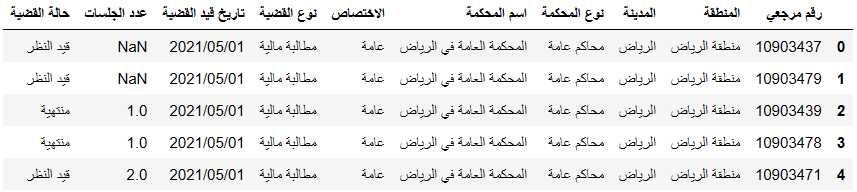
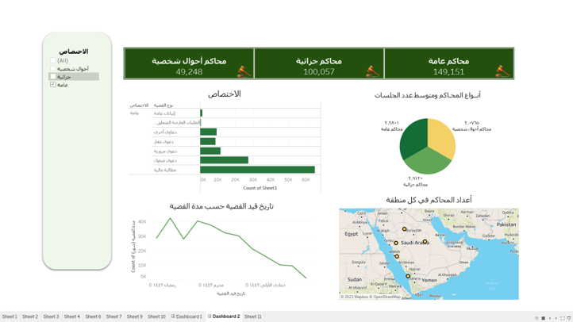
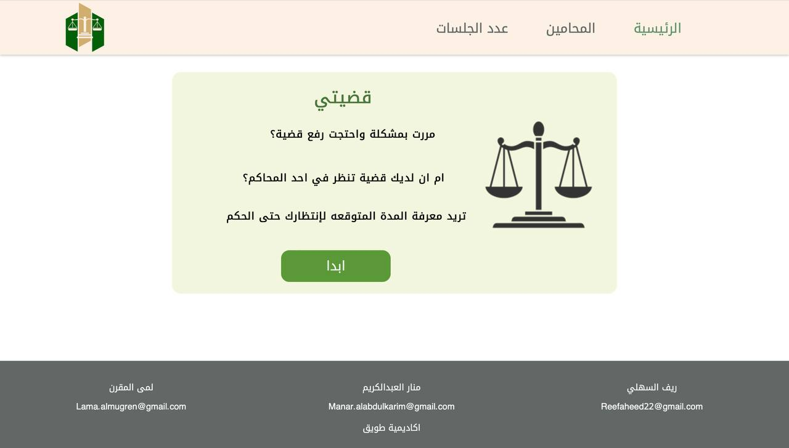
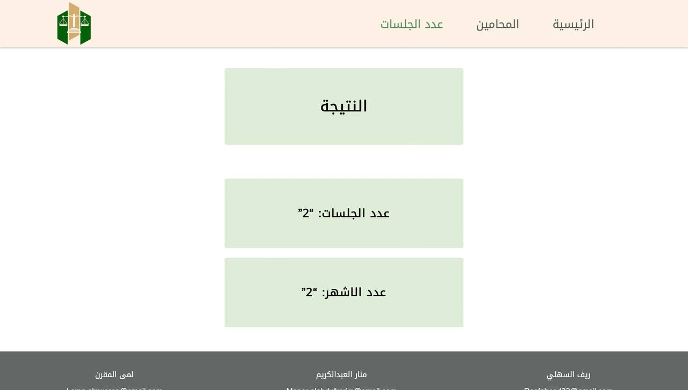
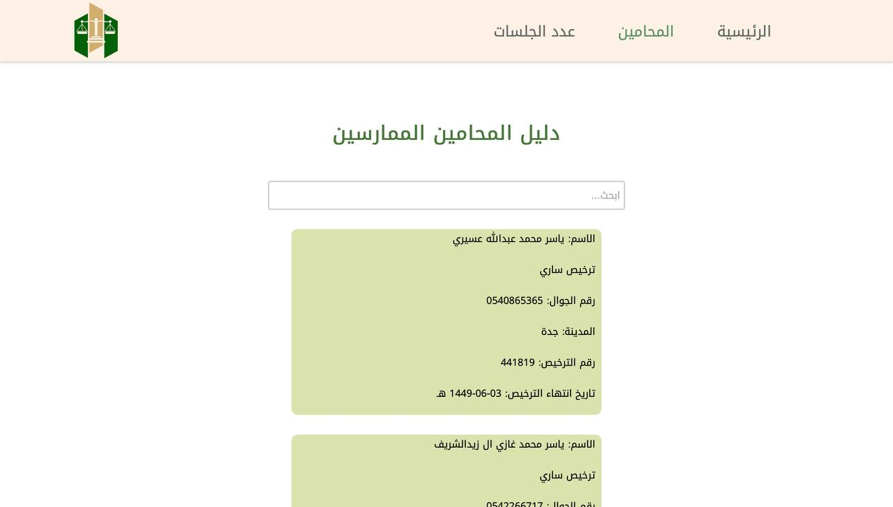

 

 
 
### The main goal of this project is to create a service that can predict the number of court sessions and Case duration by month for people who want to file a court case. It also, suggests licensed attorneys in the user's city.

## Dataset Overview
This dataset is a collection of cases and applications received by the competent courts. As shown in the picture, the data set contains a lot of information, including all regions and cities of the Kingdom, and we have three types of cases: public, personal, and penal cases.
The dataset contains the number of columns: 10 and the number of rows: 440335
 
  

- data source: البيانات المفتوحة

https://od.data.gov.sa/Data/ar/dataset/cases

## Data Visualization (Dashboard)
 

## Proposed Algorithms.
### We used machine learning ML for prediction  number of court sessions and Case duration by month
### Algorithms used 
- import xgboost
- import GradientBoostingRegressor
- DecisionTreeRegressor
- Linear Regression

## Final Results.
This is the final result that our project can choose for the user (ابدأ), then choose the country, city and his case, then select the prediction and it will display the number of court sessions and the duration of the case by month

 

 

 

## Team Work.

| Name | Role |
| ----------- | ----------- |
| Lama Mugren |I came up with the idea., Found the relative data.,did an EDA exploratory data analysis.,Data cleaning and wrangling., Data analysis.,did feature engineering.,Found merged and added new latitude and longitude data to the main data frame in order to facilitate a map chart off Saudi Arabia.,Made six insightful charts., Did data pre-processing for machine learning.,Built a more than 9 single machine learning models., Built bagging or stacking models, which are more than one model combined to improve accuracy.,fine-tune the model.,Made the pickle file for each model and the main model that we are using.,Prepared a number of excel files that contained each value that corresponds to the encoded values made by the Labelencoder() to facilitate the last step of making a Web app. |
| Reef Alashli | Data Pre-Processing , Made five insightful Charts , Made Dashboard by Tableau |
| Manar Alabdulkarim | Web scraping for lawyers data, Develop HTML pages, Django Deployment  |

