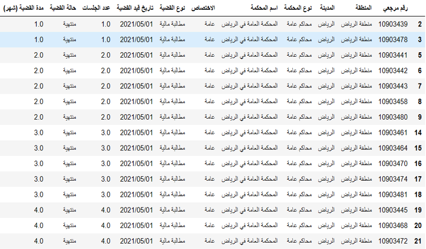

# قضيتي   

### The main goal of this project is to create a service that can predict the number of court sessions for people who want to file a court case. It also, suggests licensed attorneys in the user's city.

## Dataset Overview.
### The dataset contains the number of columns: 10 Columns and  the number of rows: 440335 

### data source: البيانات المفتوحة

https://od.data.gov.sa/Data/ar/dataset/cases

## Proposed Algorithms.
### We used machine learning ML for prediction  number of court sessions
### Algorithms used 
- import xgboost
- import GradientBoostingRegressor
- import DecisionTreeRegressor

## conclusion

| Name | Role |
| ----------- | ----------- |
| Lama Mugren | Title |
| Reef Alashli | Text |
| Manar Alabdulkarim | Text |
