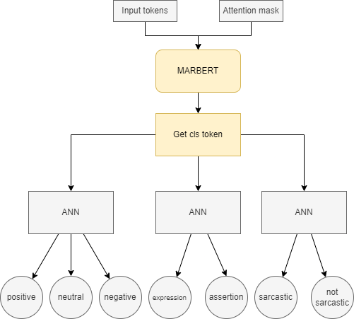

# OCTOPUS
OCTOPUS is an AI services project, that provide AI use cases as REST API 
the services we have now: 
1. Language analysis: An AI use case that takes text as input and predict sentiment, speech act and sarcasm.

# Why OCTOPUS
Most of AI companies and startups provides AI services in a form of (get-data > train-data > tuning > deploy) but in octopus we provide AI sevices as REST API in form of (subscribe > use AI use case) no need to get customer data and make the customer waiting for training and tuning.

# Language analysis project
## project overview
The project consist of two phases: 
1. Simi supervised phase : In this phase we will create the data by making 2 models, one for sarcasm and one for sppech act. 
2. Final model phase : In this phase we will train the model on the data that we produce in the first phase.
 
## Data set
First dataset link: [HERE](https://aclanthology.org/2020.osact-1.5.pdf) 
Second dataset link: [HERE](http://lrec-conf.org/workshops/lrec2018/W30/pdf/22_W30.pdf) 
## AI Model
The algorithem we choose is MARBERT which is a BERT model trained on huge arabic corpus. 
The github link for MARBERT : [HERE](https://github.com/UBC-NLP/marbert) 
The model architecture: 
 
The model architecture with more details: 
 

## Model performance
Sentiment classifier 
|class|Precision|Recall|F1-score|
|---|---|---|---|
|Positive|0.83|0.71|0.77|
|Neutral|0.78|0.77|0.78|
|Negative|0.78|0.90|0.83|
|AVG|0.80|0.79|0.79|
 
Speech act classifier 
|class|Precision|Recall|F1-score|
|---|---|---|---|
|Positive|0.95|0.91|0.93|
|Neutral|0.88|0.93|0.90|
|AVG|0.92|0.92|0.92|
 
Sarcasm classifier 
|class|Precision|Recall|F1-score|
|---|---|---|---|
|Positive|0.94|0.86|0.90|
|Neutral|0.72|0.86|0.79|
|AVG|0.87|0.86|0.86| 

