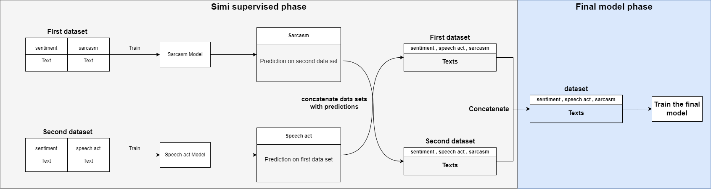

# OCTOPUS
OCTOPUS is an AI services project, that provide AI use cases as REST API 
the services we have now: 
1. Language analysis: An AI use case that takes text as input and predict sentiment, speech act and sarcasm.

# Why OCTOPUS
Most of AI companies and startups provides AI services in a form of (get-data > train-data > tuning > deploy) but in octopus we provide AI sevices as REST API in form of (subscribe > use AI use case) no need to get customer data and make the customer waiting for training and tuning.

# Language analysis project
## project overview
The project consist of two phases: 
1. Simi supervised phase : In this phase we will create the data by making 2 models, one for sarcasm and one for sppech act. 
2. Final model phase : In this phase we will train the model on the data that we produce in the first phase.
 
## Data set
First dataset link: [HERE] (https://aclanthology.org/2020.osact-1.5.pdf) 
Second dataset link: [HERE] (http://lrec-conf.org/workshops/lrec2018/W30/pdf/22_W30.pdf)
